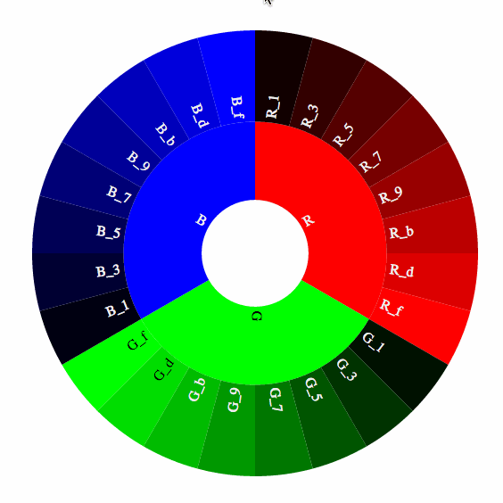

# CoffeeWheel: An R Interface to Coffee Wheel 

## Install
This package is currently not on CRAN, but you can install it from GitHub via `devtools`:

```r
library("devtools");
devtools::install_github("armish/coffeewheel")
```

## Sample Plotting
```r
library("coffeewheel");
coffeewheel(sampleWheelData, size="500");
```



## Sample Data Structure
```r
sampleWheelData <- list(
	list(
		name="R",
		children=list(
			list(name="R_1", colour="#110000"),
			list(name="R_3", colour="#330000"),
			list(name="R_5", colour="#550000"),
			list(name="R_7", colour="#770000"),
			list(name="R_9", colour="#990000"),
			list(name="R_b", colour="#bb0000"),
			list(name="R_d", colour="#dd0000"),
			list(name="R_f", colour="#ff0000")
		)
	),
	list(
		name="G",
		children=list(
			list(name="G_1", colour="#001100"),
			list(name="G_3", colour="#003300"),
			list(name="G_5", colour="#005500"),
			list(name="G_7", colour="#007700"),
			list(name="G_9", colour="#009900"),
			list(name="G_b", colour="#00bb00"),
			list(name="G_d", colour="#00dd00"),
			list(name="G_f", colour="#00ff00")
		)
	),
	list(
		name="B",
		children=list(
			list(name="B_1", colour="#000011"),
			list(name="B_3", colour="#000033"),
			list(name="B_5", colour="#000055"),
			list(name="B_7", colour="#000077"),
			list(name="B_9", colour="#000099"),
			list(name="B_b", colour="#0000bb"),
			list(name="B_d", colour="#0000dd"),
			list(name="B_f", colour="#0000ff")
		)
	)
);
```

## Credits
This version of the wheel was adapted from [Jason Davies's Coffee Wheel example](https://www.jasondavies.com/coffee-wheel/). 
Built with [D3.js](http://d3js.org/). Sunburst zooming based on an [example](http://bl.ocks.org/mbostock/4348373) by [Mike Bostock](http://bost.ocks.org/mike).
